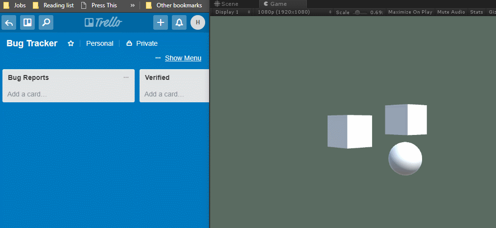
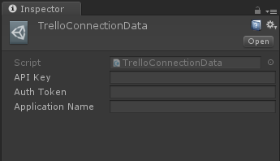
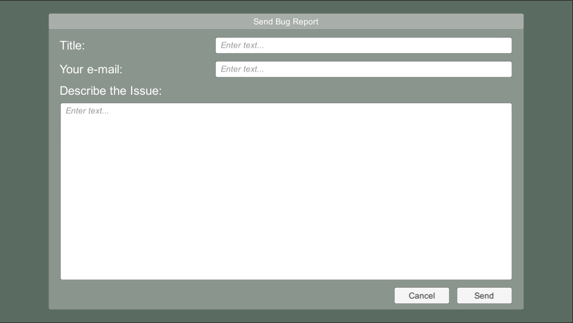
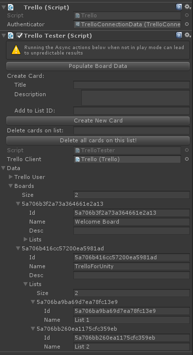

# TrelloForUnity
A trello client and bug reporter for Unity.

### What it is ###
This release of TrelloForUnity provides access to parts of the Trello API and has an implementation of a bug reporter to let you send bug reports straight to a selected Trello list.

Implemented features in this release are:

* Authentication through API Key and server authorization token
* Reading Members, Boards, Lists and Cards
* Creating cards
* Adding attachments to cards

Additionally the bug reporter:
* Stores calls to Unity's logger
* Collects some hardware device info and sends it to Trello
 
### What it is NOT ###
Please note that someone with the necessary skills would probably be able to gain access to the connected Trello account (through the API, the password will always be safe). This makes the current implementation especially suited for closed tests, but not for large tests with many anonymous users. It is also important to use a trello account that does not have access to anything important (except your bug reports).

## How to Get Started ##

To connect your app to Trello, you'll first need an API key and an authorization token. 
It is heavily recommended to make a new Trello account specifically for your app to use. Once logged into that account, go to https://trello.com/app-key to get the API key. 

For now the easiest way to get up and running is to manually generate an authorization token and bake that into your app. Select the option to manually generate a token to get an authorization token for your app.

<i>
When generating a token, Trello uses the default name 'Server Token'. This is what will show up in your 'authorized apps' list later. If you want to change this, check your address bar on the authorization screen, and change the '&name=Server%20Token' parameter to the name you want.
</i>

Once you have your keys, and the latest version of TrelloForUnity in your Unity project, create a 'TrelloConnectionData' object through the create menu in the project view. Fill in your API key, the authorization token you have generated. The application name is currently not used.

Once the authorization object has been set up, you can now add a Wispfire.TrelloForUnity.Trello monobehaviour to a GameObject, plug in the authenticator object and start connecting to Trello through the provided API on the Trello monobehaviour.

### Setting up the Bug Reporter ###
Check out the scene Assets/Wispfire/TrelloForUnity/Example/Example.unity to see how the bug reporter is set up.
Just two things are missing:
* You'll need to add your own authentication object to the Trello monobehaviour.
* The BugReportToTrelloCard component (on BugReporter GameObject) needs a listID for where it should create new cards.

To find the right ListID, there's a helper component on the Trello object called TrelloTester. After adding your authentication object to the Trello component, click the 'Populate Board Data' button on the tester to find all the boards your account has access to. After that, find the board and list that you want the bug reporter to post to. Copy the ID of this list to the BugReportToTrelloCard component on the bug reporter under 'Bug Report List ID'.

Hit play and then F8 to open the bug reporter (hotkey can be configured on the Bug Reporter component). Fill in some details and hit Send. If you've followed the steps correctly, a new card should appear with the title you added, the scene name, app version number and platform, along with a screenshot and system details. You are encouraged to modify the data the bug reporter collects and how it is represented to what makes sense for your project.

### Compatibility ###
TrelloForUnity has been developed on Unity 2017.1 and tested on 2017.1 through 2017.3 and built for PC, Mac and Linux. Other versions may work, but are not guaranteed to. 

# License
Copyright 2018 Wispfire

Permission is hereby granted, free of charge, to any person obtaining a copy of this software and associated documentation files (the "Software"), to deal in the Software without restriction, including without limitation the rights to use, copy, modify, merge, publish, distribute, sublicense, and/or sell copies of the Software, and to permit persons to whom the Software is furnished to do so, subject to the following conditions:

The above copyright notice and this permission notice shall be included in all copies or substantial portions of the Software.

THE SOFTWARE IS PROVIDED "AS IS", WITHOUT WARRANTY OF ANY KIND, EXPRESS OR IMPLIED, INCLUDING BUT NOT LIMITED TO THE WARRANTIES OF MERCHANTABILITY, FITNESS FOR A PARTICULAR PURPOSE AND NONINFRINGEMENT. IN NO EVENT SHALL THE AUTHORS OR COPYRIGHT HOLDERS BE LIABLE FOR ANY CLAIM, DAMAGES OR OTHER LIABILITY, WHETHER IN AN ACTION OF CONTRACT, TORT OR OTHERWISE, ARISING FROM, OUT OF OR IN CONNECTION WITH THE SOFTWARE OR THE USE OR OTHER DEALINGS IN THE SOFTWARE.